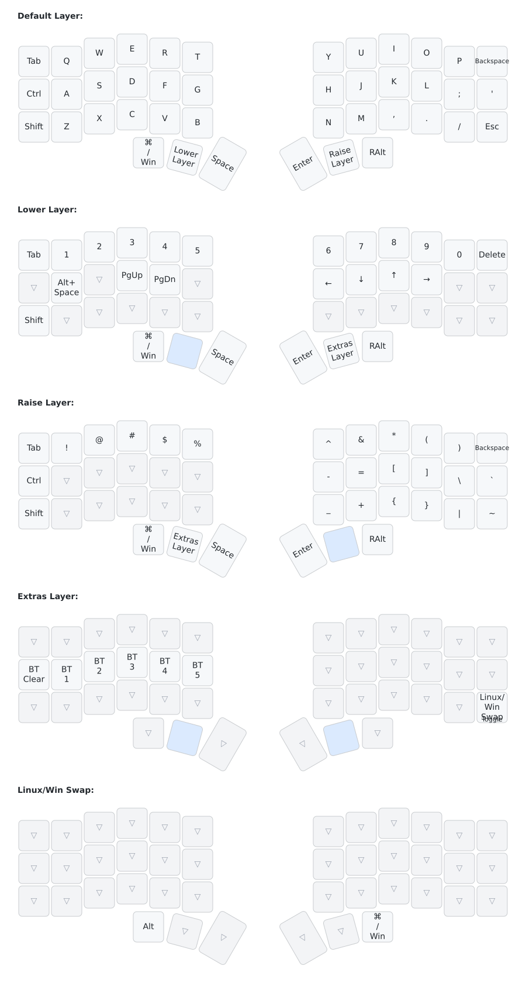
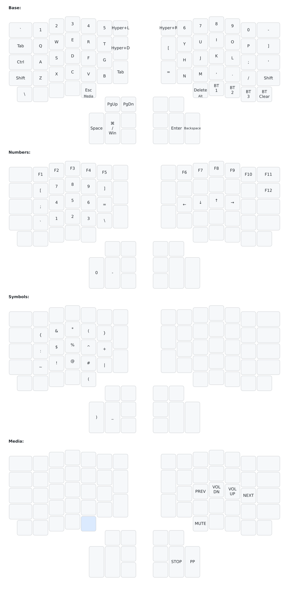

# Corne ZMK configuration

My main keyboard is a **42-key wireless Corne** running ZMK. This repository
contains its keymap and firmware build configuration, plus a secondary original
ErgoDox configuration.

## Corne keymap

The [keymap source](config/corne.keymap) uses QWERTY with dedicated Control and
Shift keys, and five layers. There are no home-row mods in the Corne keymap.



[Open or download the full-size diagram](keymap-drawer/corne.svg).

| Layer | How to access it | Contents |
| --- | --- | --- |
| Default Layer | Active normally | QWERTY, modifiers, punctuation, and thumb controls |
| Lower Layer | Hold the left middle thumb key | Numbers, Delete, Page Up/Down, arrow keys, and Alt+Space |
| Raise Layer | Hold the right middle thumb key | Symbols, brackets, and braces |
| Extras Layer | Hold both Lower and Raise | Bluetooth controls and the Linux/Windows toggle |
| Linux/Win Swap | Toggle with the bottom-right key while in Extras | Changes left thumb GUI to Alt and right thumb Alt to GUI; other keys pass through |

The default thumb keys, from left to right, are:

```text
Left hand:  GUI / Command   Lower   Space
Right hand: Enter          Raise   Right Alt
```

Lower and Raise are momentary layers: release the thumb key to return. The
Linux/Windows swap stays active until toggled again. `GUI` means Command on macOS
and the Windows/Super key on Windows/Linux.

On Extras, the left home row contains **BT Clear, BT 1, BT 2, BT 3, BT 4, BT 5**.
The five profile labels correspond to ZMK profile indices 0–4. BT Clear removes
the pairing for the currently selected profile.

In the diagrams, **▽** means the key passes through to an underlying active
layer. Blank keys in the ErgoDox diagram are disabled bindings. Blue keys mark
the keys held to access a layer. The swap diagram shows the override layer;
ordinary keys continue to come from the layers underneath it.

## Firmware

The [build matrix](build.yaml) builds the Corne left and right halves, the
ErgoDox, and a settings-reset image. The Corne targets use `nice_nano//zmk` and
the `corne_left` / `corne_right` shields. Artifact names retain the
`nice_nano_v2` suffix.

ZMK is pinned to commit `0331b7d16e80954b807917f9323e59ffc1e3b626` in
[config/west.yml](config/west.yml). The firmware workflow uses ZMK's reusable
`build-user-config.yml@v0.3` workflow.

To build and flash:

1. Push a configuration change, or run **Build ZMK firmware** manually from the
   repository's GitHub Actions tab.
2. Download the firmware artifacts from the successful run.
3. Put each Corne half into its UF2 bootloader and copy the corresponding
   left/right `.uf2` file onto its mounted drive.

The [Corne configuration](config/corne.conf) enables sleep after one hour of
inactivity and battery reporting for both halves. RGB underglow and OLED display
support are currently disabled.

## Automatic keymap diagrams

[Draw keymaps](.github/workflows/draw-keymaps.yml) parses both `.keymap` files
with [keymap-drawer](https://github.com/caksoylar/keymap-drawer) and generates
SVG images and intermediate YAML in [keymap-drawer/](keymap-drawer/).

- Pushes that change keymaps, drawing settings, or physical layouts regenerate
  and commit the diagrams to the same branch.
- Pull requests verify that both keymaps render and upload the results as a
  `keymap-diagrams` artifact, without committing changes.
- **Run workflow** can regenerate diagrams manually.

The workflow needs permission to write repository contents to commit updated
diagrams. SVGs can be viewed directly in a browser, embedded in Markdown, or
printed. Key legends are derived from the keymap source; do not edit generated
SVG/YAML files by hand.

To regenerate locally, install [uv](https://docs.astral.sh/uv/getting-started/installation/)
(version 0.12.21 or newer)
and run:

```sh
bash scripts/draw-keymaps.sh
```

The script uses `uv run --locked` to manage Python and install the dependencies
automatically. Python is pinned to **3.14.7** in [.python-version](.python-version)
for compatibility with uv 0.12.21;
uv downloads that interpreter if needed, both locally and in CI.
The renderer version is pinned in
[pyproject.toml](pyproject.toml), and [uv.lock](uv.lock) locks its dependencies.
GitHub Actions uses the same locked environment through `uv sync --locked`.
[Physical layout files](keymap-layouts/) are stored locally, including an
ErgoDox layout reordered to match this repository's custom matrix transform.
Drawing colors and key labels are configured in
[keymap_drawer.config.yaml](keymap_drawer.config.yaml).

## Secondary keyboard: ErgoDox

The original ErgoDox uses a
[teensy2nicenano adapter](https://github.com/tahnok/teensy2nicenano) and the
[custom shield](config/boards/shields/ergodox/). Its separate keymap has Base,
Numbers, Symbols, and Media layers, with Hyper shortcuts and Bluetooth controls.

<details>
<summary>View the ErgoDox keymap</summary>



[Open the full-size ErgoDox diagram](keymap-drawer/ergodox.svg).

</details>
